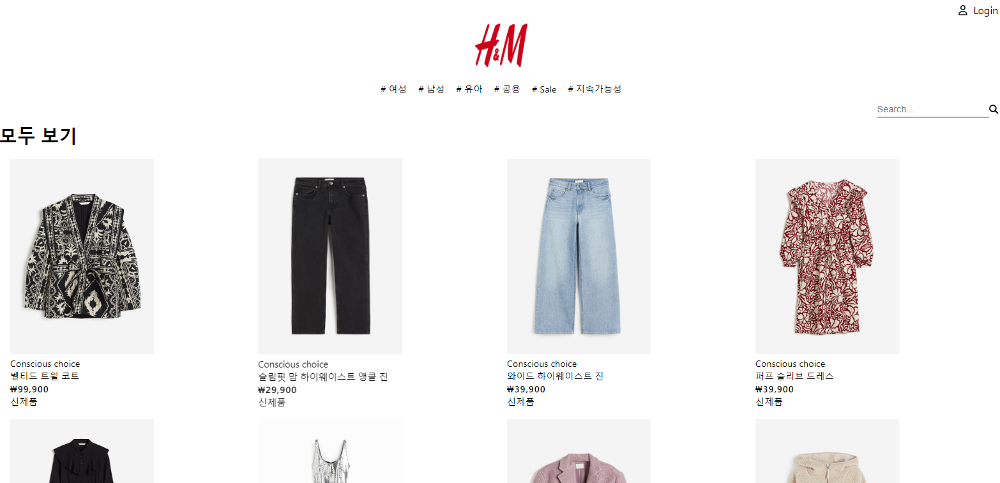

<div align="center">

  <h1>🛒 Ecommerce website project! </h1>

<!-- Badges -->
<h4>
    <a href="https://hyun198-ecommerce.netlify.app">View Demo</a>
</h4>

<p>H&M 웹 사이트를 참고하여 상품과 디자인을 이용했지만</p>
<p>해당 웹 사이트에는 없는 반응형 디자인 및 장바구니 기능, 카테고리 기능은 추가로 구현</p>

</div>

<br />

<!-- Table of Contents -->

# Table of Contents

- [About the Project](#about-the-project)
  - [Tech Stack](#tech-stack)
  - [Features](#features)
- [Getting Started](#getting-started)
  - [Prerequisites](#prerequisites)
  - [Installation](#installation)
- [Acknowledgements](#acknowledgements)
- [Contributors](#contributors)

<!-- About the Project -->

## 💻About the Project

<div align="center"> 
  
</div>

<!-- TechStack -->

### ⚡Tech Stack⚡

<ul>
    
   
   
   
   
</ul>

<!-- Features -->

### Features

- 로그인 상태를 관리 하기 위해 서버쪽에서 처리하는게 아닌 상태로 관리

<!-- Getting Started -->

## Getting Started

<!-- Prerequisites -->

### Prerequisites

This project uses Yarn as package manager

```bash
 npm install --global npm
```

<!-- Installation -->

### Installation

Install my-project with npm

```bash
  npm install my-project
  cd my-project
```

<!-- Run Locally -->

### Run Locally

Clone the project

```bash
  git clone https://github.com/Hyun198/e-commerce.git
```

Go to the project directory

```bash
  cd my-project
```

Install dependencies

```bash
  npm install
```

Start the server

```bash
  npm start
```

## contributors

    I will keep updating this project for better result👍

    But if you have smt to help me, let me know please👋

<!-- Acknowledgments -->

## Acknowledgements

Use this section to mention useful resources and libraries that you have used in your projects.

- [Redux](https://ko.redux.js.org/introduction/getting-started/)
- [React Redux](https://react-redux.js.org/)
